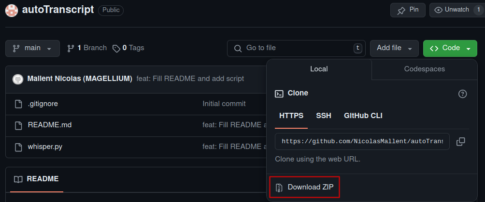
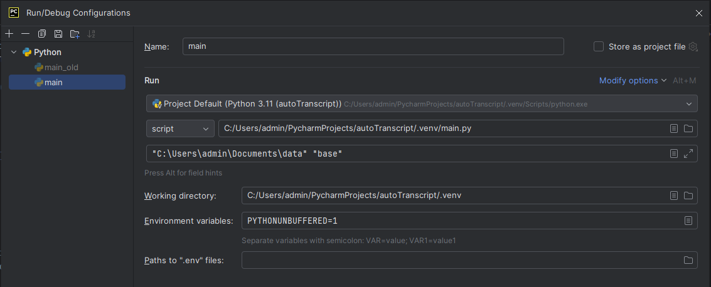

# autoTranscript  
Transcription automatique avec Whisper AI (en local / en ligne)
#### Authors : Cécile de Hosson (UPCité - LDAR), Sylviane Pompéï (UPCité - LDAR) & Pierre Andrieu (UPCité - LDAR)
#### Contributor : Nicolas Mallent (Ingénieur Recherche et Développement Robotique)

## Préambule 
Vous avez le choix entre deux options :   
-   soit installer whisper directement sur votre machine (en local, donc) si vous disposez d’un émulateur PYTHON.  
-   soit (et c’est ce que j’utilise moi (note de l'auteure)) utiliser un émulateur PYTHON en ligne (gg colaboratory).  

## Récupération du projet

Télécharger ce projet en cliquant sur `< > Code > Download ZIP` (Comme montré ci-dessous) :


### 1. Configurer et utiliser whisper en local

Whisper est un logiciel libre de OpenAI. La configuration proposée ci-dessous respecte le cadre de la RGDP puisque les transcriptions sont réalisées en “***local***.”
Whisper ne fonctionne qu’avec des fichiers audio, il vous sera indispensable d’extraire le son des vidéos pour pouvoir les transcrire.
Cette étape est indiquée au point 1.3.1, une fois que vous aurez configuré Whisper mais vous pouvez commencer le tutoriel par ce point avant de revenir au 1.1.  

**Avertissement**  
La transcription automatique par Whisper est un travail relativement lourd pour l’ordinateur, ainsi, il est préférable d’utiliser une machine un peu puissante pour que les transcriptions ne durent pas trop longtemps. Si vous avez un ordinateur portable, préférez lancer les transcriptions la nuit lorsque vous n’avez pas besoin de votre ordinateur.  

La configuration suivante n’est disponible que sur Windows. Si vous avez un Mac, vous pouvez créer une partition sur votre disque dur pour installer Windows et utiliser Whisper en local.  

#### 1.1 Configurer whisper

Les fichiers proposés sont à télécharger et à installer les uns après les autres dans l’ordre suivant :

- [python 3.14](https://www.python.org/downloads/release/python-31114/)
A partir du lien ci-joint, sélectionner « Windows installer (64-bit) » ou télécharger directement le fichier depuis le lien suivant :
https://www.python.org/ftp/python/3.14.2/python-3.14.2-amd64.exe

- [ffmpeg](https://github.com/BtbN/FFmpeg-Builds/releases)
A partir du lien ci-joint, télécharger « ffmpeg-master-latest-win64-gpl-shared.zip ». Une fois téléchargé, dézippez le et renommer le "ffmpeg" puis copier/coller le dossier dans le dossier `C:\Program Files\` avec les droits d'admin.  
Une fois fait, vous devriez avoir `C:\Program Files\ffmpeg` qui contient les sous dossiers bin, doc, include, etc..

- [git](https://git-scm.com/download/win)
A partir du lien ci-joint, sélectionner la version « 64-bit Git for Windows Setup » ou télécharger le fichier depuis le lien suivant :  
[64-bit Git for Windows Setup](https://github.com/git-for-windows/git/releases/download/v2.43.0.windows.1/Git-2.43.0-64-bit.exe)
    - Lors de l’installation, ne modifiez pas les coches par défaut, laisser la configuration telle quelle.

- pycharm : (à installer en dernier)
Télécharger le fichier depuis le lien suivant :  
https://www.jetbrains.com/fr-fr/pycharm/download/download-thanks.html?platform=windows&code=PCC
    - prendre pycharm-community-2025.3.1.1


#### 1.2 Utiliser whisper pour la première fois

- Créer un dossier de sauvegarde de vos transcriptions sur votre bureau ou à l’endroit que vous souhaitez et copier le chemin d’accès à ce dossier.
- Lancer pycharm
- Créer un nouveau projet pour toutes les transcriptions par whisper :
    - Donner un nom rappelant sa fonction : « whisper », « transcrire », etc.
    - Préciser la localisation du dossier de sauvegarde en collant le lien du chemin précédemment copié
    - Vérifier que venv est coché
- Clic droit sur le dossier `.venv > New > Python File`, nommez le fichier ainsi créé (le tutoriel utilisera le nom « main.py »).
  - Copier le **contenu** d'autoTranscript/main.py téléchargé à la toute première étape de ce tutoriel (« Récupération du projet ») et collez-le dans le .venv/main.py que vous venez de créer
- Dans le fichier .venv/main.py, si whisper est souligné en rouge :
  - Ouvrir le terminal de l’environnement virtuel venv 
  - Recopier et entrer : `pip install git+https://github.com/openai/whisper.git`
> Il est possible que vous ayez un problème avec numpy, pour le régler, faites:  `pip install numpy<2`

#### 1.3 Utiliser Whisper
> Attention !
> Le chemin et le nom des fichiers ne doivent pas comporter d'espaces, d'accents ou tout autre caractère spécial.  
> Privilégiez des `_` ou des `-` pour remplacer les espaces.

##### 1.3.1 Extraction du son d’une vidéo locale

- Télécharger et installer [Audacity](https://www.audacityteam.org/download/windows/):
    - Choisir : 64 bit installer (recommended).
- Ouvrir Audacity.
- Vérifier que ffmpeg est disponible (étape à ne réaliser qu’une seule fois) :
    - Cliquer sur `Edition > Préférences > Bibliothèques`.
    - Bibliothèque FFmpeg : cliquer sur Localiser... puis, si nécessaire, sur Téléchargement.
- Glisser la vidéo sur l’écran d’Audacity.
- `Fichier > exporter l’audio` : exporter en mp3.

##### 1.3.2 Mise en route de Whisper

- Ouvrir PyCharm, et le projet que vous avez créé dans Whisper.
- Aller dans le dossier .venv (environnement virtuel), le sous-dossier du projet.
- Ce script a besoin qu'on lui donne 2 paramètres d'entrées :
  - Le chemin vers le dossier où sont stockés les enregistrements :
      - Dans `Run > Edit Configurations`, remplissez le champ "Script Parameters" avec le chemin de votre dossier (par exemple "C:\Users\admin\Documents\audio")
      - Cliquez sur le bouton `Apply` puis `OK`
      - Pour récupérer le chemin du dossier : clic droit sur la barre du dossier contenant le fichier mp3, puis choisir "Copier l’adresse sous forme de texte".
  - Ainsi que le modèle de vocabulaire (pour indiquer à la transcription le modèle de vocabulaire à utiliser) :
      - "base" : petit, téléchargement immédiat (139 M)
      - "medium" : moyen, téléchargement 20 minutes (1.42 G)
      - "large" : grand, téléchargement 1 heure (2,88 G) > privilégier ce modèle pour une transcription de qualité
- Exécuter main.py

> Le téléchargement du modèle de vocabulaire ne se fait qu'une fois.



#### 1.4 Récupération des fichiers transcrits

Les fichiers ont pour nom « output_<nom_de_l_audio>_<modèle>.txt ».   
Ils sont enregistrés dans le même dossier que l’audio qui a été transcrit.

### 2. Configurer et utiliser Whisper en ligne
#### 2.1 Pour préparer le drive (à faire une seule fois)
##### 2.1.1 Sources
- [article](https://kevinstratvert.com/2023/01/19/best-free-speech-to-text-ai-whisper-ai/)
- [vidéo](https://www.youtube.com/watch?v=8SQV-B83tPU)

##### 2.1.2 Installer Google Colaboratory 

1. Aller sur [Google Drive](https://drive.google.com/) et créer un compte Google (gratuit), si vous n’en avez pas encore un.
2. Sur le coin en haut à gauche, cliquer sur `New button > More > Connect more apps`.
3. En haut du dialogue, écrire dans la fenêtre de recherche Google Colaboratory et lancer la recherche.
4. Choisir la première option : “Colaboratory”
5. Cliquer sur le bouton Install, puis sur Continue et sur OK pour connecter Google Colaboratory à Google Drive.
6. Colaboratory a été installé.
7. Cliquer sur le bouton `Done` et fermer la fenêtre “Connect more apps”.

##### 2.1.3 Configurer Google Colaboratory 

1. Aller sur [Google Drive](https://drive.google.com/) et se connecter à son compte Google.
2. Sur le coin en haut à gauche, cliquer sur `New button > More > Colaboratory`. Ceci ouvre Colaboratory.
3. Sur le coin en haut à gauche, donner un nom au fichier en sélectionnant Untitled.ipynb et en le renommant en quelque chose de plus parlant (p. ex. Transcribe_audio.ipynb).
4. Cliquer sur le menu `Runtime` et sélectionner `Change runtime type` pour ouvrir le dialogue `Notebook settings`
5. Régler le `Hardware accelerator` sur `GPU`. Ceci permet d’utiliser la carte graphique, sur laquelle Whisper AI tourne le mieux. 
> Noter l’adresse du Drive.

#### 2.2 Commandes verbatim pour transcrire 

1. Pour arriver sur mon Drive : https://colab.research.google.com/drive/.....
2. Cliquer sur Transcribe_audio.ipynb
3. Glisser le fichier à traduire dans l’espace fichiers de ce dossier (icône de dossier sur la marge gauche)
4. Pour chaque session d’utilisation, réinstaller whisper :

```
!pip install git+https://github.com/openai/whisper.git
!sudo apt update && sudo apt install ffmpeg
!whisper "Titre.mp3" --model large --language fr
```

#### 2.3 Fichiers résultats à sauvegarder
##### 2.3.1 Fichier Titre.json
Format contenant du texte et des balises de temps en java

##### 2.3.2 Fichier Titre.srt
Format contenant le numéro de phrase, suivi des balises temporelles, suivi du texte (à ouvrir en UTF8 avec nomenclature pour les accents) :
```
1 00 :00 :00,000 –> 00 :00 :06,000 Dans le bouquin, non, . . .
```

##### 2.3.3 Fichier Titre.tsv
Format avec le début en ms, la fin en ms, le texte sur une même ligne (ouvrir en UTF8), un peu comme du csv :
```
0 6000 Dans le bouquin, non, . . .
```

##### 2.3.4 Fichier Titre.txt
Format ne contenant que le texte, découpé par des retours à la ligne (UTF8)

##### 2.3.5 Fichier Titre.vtt
Format avec balises temporelles et texte à la ligne suivante (UTF8) :
```
00 :00.000 –> 00 :06.000
Dans le bouquin, non, 
```
